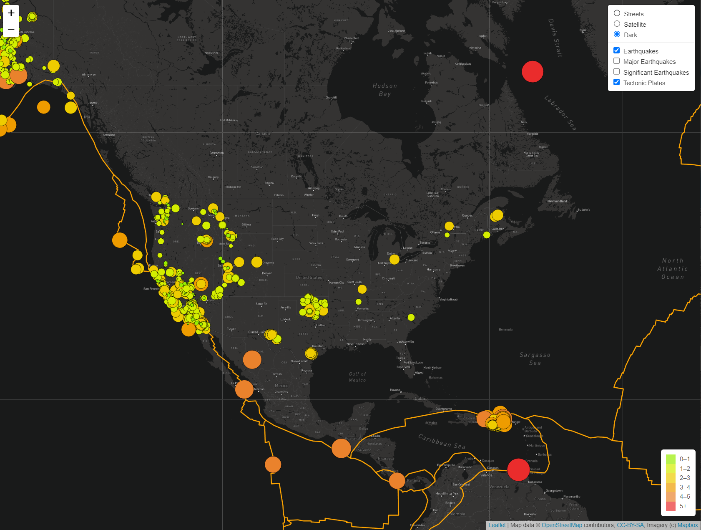

# Mapping_Earthquakes

For this project, I was challenged with creating an interactive map that tracks earthquakes. Using an API for the map and pulling data from a website that tracks earthquakes in live time, I was able to combine these two variables to make the data easily visable to anyone. In order to access this map, simply click on the index.html file in the Earthquake_Challenge folder. Once the map is open, you can see there are numerous filters that you can change. First off, you can change the color design of the map. There are three options for that: "Streets", "Satellite", (or my favorite) "Dark". Then you can filter earthquakes based on the magnitude of them. To see all earthquakes, select "Earthquakes." To see anything over a magnitude over 4, select "Major Earthquakes." To see anything over a magnitude of 5, select "Significant Earthquakes." Users can also toggle off and on the option to see where the tectonic plates are. Enjoy!